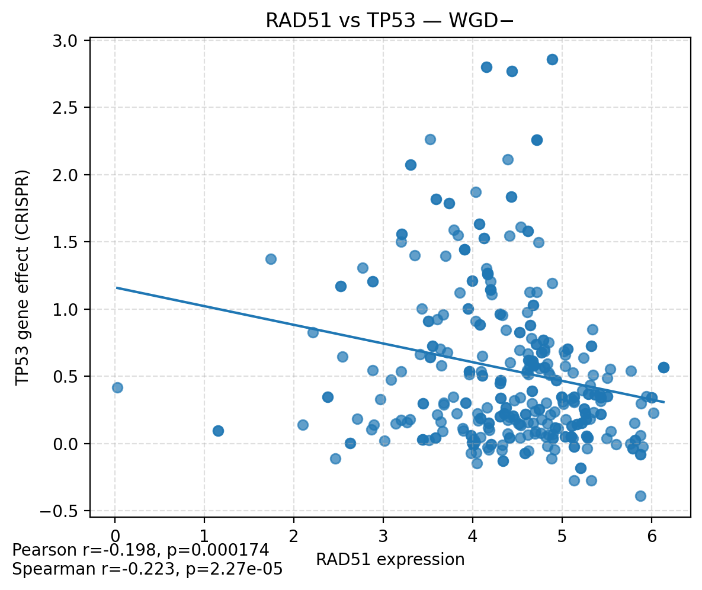
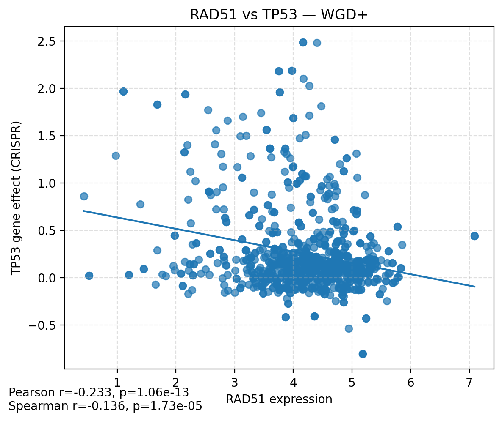
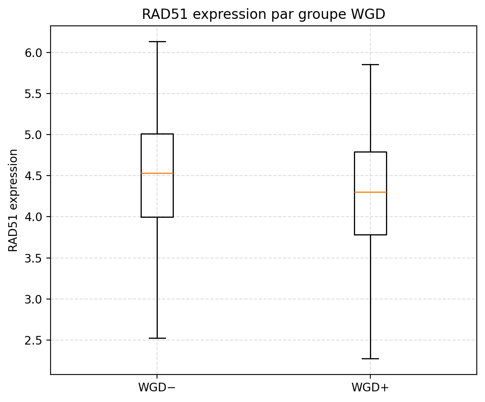
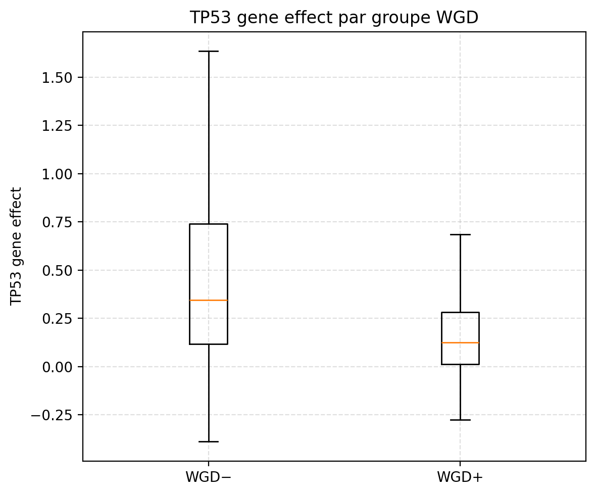

<div align="center">

# Analysis of RAD51 & TP53 (WGD)

[](#)
[](#)
[](#)

**Étude de la relation entre `RAD51` (expression) et `TP53` (gene effect CRISPR) selon le statut de duplication du génome entier (WGD).**  
Ce dépôt contient les données, scripts et figures nécessaires pour reproduire l’analyse, ainsi qu’un rapport synthétique (PDF).

</div>

---

## 🖼️ Figures initiales 

<div align="center">
  
</div>

<div align="center">
  
</div>


---

## 🔗 Liens directs

- 📄 **Rapports**
  - PDF : [`docs/Analysis_of_RAD51_and_TP53.pdf`](docs/Analysis_of_RAD51_and_TP53.pdf)
  - Word : [`docs/Analysis of RAD51 and TP53.docx`](docs/Analysis%20of%20RAD51%20and%20TP53.docx)

- 📓 **Notebook**
  - [`notebooks/Analysis.ipynb`](notebooks/Analysis.ipynb)

- 🧮 **Scripts**
  - Analyse statistiques : [`src/stats.py`](src/stats.py)
  - Figures (génération des graphes) : [`src/plots.py`](src/plots.py)
  - Pipeline/Autres : [`src/script.py`](src/script.py)

- 📊 **Données**
  - [`data/merged_TP53_RAD51_WGD_norm.csv`](data/merged_TP53_RAD51_WGD_norm.csv)
  - [`data/cell_lines_WGD_oui.csv`](data/cell_lines_WGD_oui.csv)
  - [`data/cell_lines_WGD_non.csv`](data/cell_lines_WGD_non.csv)
  - [`data/OmicsSignaturesProfile.csv`](data/OmicsSignaturesProfile.csv)
  - *(volumineux → Releases/LFS si besoin)* `CCLE_expression.csv`, `Achilles_gene_effect.csv`

---

## 🧮 Scripts
- Analyse statistiques : [`src/stats.py`](src/stats.py)
- Figures : [`src/plots.py`](src/plots.py)

<details>
<summary><strong>🧪 Méthode (cliquer pour déplier)</strong></summary>

**Objectif.** Tester si la relation entre l’expression **RAD51** et l’**effet gène TP53** diffère selon le statut **WGD**.

**Pipeline.**
1. **Statut WGD.** Construction de `WGD` (0/1) à partir des listes `cell_lines_WGD_oui.csv` (→1) et `cell_lines_WGD_non.csv` (→0) via un identifiant commun (idéalement `DepMap_ID`).
2. **Table d’analyse.** À partir de `merged_TP53_RAD51_WGD_norm.csv`, conserver :
   - `RAD51_expr` (depuis `RAD51`),
   - `TP53_effect` (depuis `p53`),
   - `WGD` (0/1).  
   Retirer les lignes incomplètes.
3. **Statistiques.**
   - Descriptif par groupe (n, moyenne, écart-type).
   - Corrélations **par groupe** (WGD−, WGD+).
   - Modèle avec interaction : `TP53_effect ~ RAD51_expr * WGD` (teste la différence de pente entre groupes).
4. **Visualisations.** Scatters par groupe avec droite de régression + boxplots; PNG enregistrés dans `figures/`.

</details>

---

## 🖼️ Figures issues de l’analyse statistique

**Scatter RAD51 ↔ TP53 (WGD− / WGD+)**  
<br>
 

**Boxplots par groupe WGD**  
<br>
 

---

<details>
<summary><strong>✅ Résultats (cliquer pour déplier)</strong></summary>

- Descriptif par groupe : [`results/summary_stats.csv`](results/summary_stats.csv)  
- Corrélations (Pearson / Spearman) : [`results/correlations.csv`](results/correlations.csv)  
- Pentes estimées par groupe (slopes) : [`results/simple_slopes.csv`](results/simple_slopes.csv)  
- Rapport de régression (texte) : [`results/model_summary.txt`](results/model_summary.txt)

</details>

---

## 🗂️ Arborescence

- 📁 **data/**
  - merged_TP53_RAD51_WGD_norm.csv
  - cell_lines_WGD_oui.csv • cell_lines_WGD_non.csv
  - OmicsSignaturesProfile.csv
- 📁 **figures/**
  - rad51_vs_tp53_WGD_minus.png • rad51_vs_tp53_WGD_plus.png
  - tp53_by_WGD_box.png • rad51_by_WGD_box.png
  - Figure WGD+.png • Figure WGD-.png
- 📁 **results/** → summary_stats.csv, correlations.csv, simple_slopes.csv, model_summary.txt
- 📁 **src/** → script.py, stats.py, plots.py
- 📁 **notebooks/** → Analysis.ipynb
- 📁 **docs/** → Analysis_of_RAD51_and_TP53.pdf, Analysis of RAD51 and TP53.docx
- 📄 **README.md**

---

## ▶️ Reproduire localement
```bash
python3 -m venv .venv && source .venv/bin/activate
pip install pandas numpy scipy statsmodels matplotlib
python src/stats.py   # -> results/
python src/plots.py   # -> figures/
